<p align="center">
  <strong>MQTT TLS Bridge</strong><br/>
  MQTT/TLS testing utility with embedded broker, client, and automation control
</p>

<p align="center">
  <a href="#quick-start">Quick Start</a> •
  <a href="#architecture">Architecture</a> •
  <a href="#control-server-protocol">Control Protocol</a> •
  <a href="#troubleshooting">Troubleshooting</a>
</p>

<p align="center">
  
  
  
  
</p>


A Windows WPF utility that combines:

- an **MQTTS broker** (server) for test purposes, and
- an **MQTT client** (connect / subscribe / publish),
  plus a lightweight **TCP control server** (INI-style packets) to automate the UI from external test tools.

Target use case: MQTT/TLS interoperability testing (TLS 1.3 / 1.2), certificate validation scenarios, and scripted automation of broker/client flows.

---
## 📚 Contents
- [Quick Start](#quick-start)
- [Features](#features)
- [Control Server Protocol](#control-server-protocol)
- [Architecture](#architecture)
- [Troubleshooting](#troubleshooting)
- [Security Notes](#security-notes)
---

## Quick Start

This section provides minimal, working examples to verify that the broker,
client, and control server are functioning correctly.
No prior knowledge of the internal architecture is required.

---

### Quick Start – Broker Only (TLS 1.3)

This scenario starts the embedded MQTTS broker and waits for incoming TLS
connections.

1. Prepare a PFX certificate file  
   Example path: `cert\devcert.pfx`

2. Configure the broker settings in the UI
   - Broker port: `8883`
   - TLS protocol: `1.3`
   - PFX path and password

3. Start the broker using the control server

Example request:

```ini
id=1
cmd=broker.start
port=8883
pfx=cert\devcert.pfx
pfxpw=yourPassword
tls=13
```

Expected response:

```ini
id=1
ok=1
running=1
```

At this point, the embedded MQTTS broker is listening for TLS connections.

### Quick Start – Client to External Broker

This scenario connects the built-in MQTT client to an external broker,
subscribes to a topic, and publishes a test message.

1. Connect the client

```ini
id=2
cmd=client.connect
host=127.0.0.1
port=8883
useTls=1
tls=13
allowUntrusted=1
```

Expected response:

```ini
id=2
ok=1
state=connected
```

2. Subscribe to a topic

```ini
id=3
cmd=client.subscribe
filter=test/topic
qos=1
```

3. Publish a message

```ini
id=4
cmd=client.publish
topic=test/topic
payload=hello mqtt
```

If the broker echoes the message back to subscribed clients,
the client connection is working correctly.

---

### Quick Start – Notes

- The control server expects UTF-8 encoded text

- A blank line terminates each request packet

- The id field is user-defined and echoed in the response

- Commands can be issued while the UI is running or minimized to tray

- Broker and client can be operated independently

---

## Features

### Client (MQTT)

- Connect to an MQTT broker with optional TLS
- Subscribe / Unsubscribe with QoS
- Publish with QoS and Retain
- TLS protocol selection:
  - TLS 1.3
  - TLS 1.2
  - TLS 1.3 + 1.2

### TLS Certificate Validation Modes (Client)

- **Strict**: OS trust, no SSL policy errors
- **Allow Untrusted**: accept any certificate
- **Custom CA (file)**: validate using a custom root store
- **Thumbprint Pinning**: validate by certificate thumbprint

### Broker (MQTTS Server)

- Start / Stop an encrypted MQTT broker
- Uses PFX (PKCS#12) certificate
- TLS protocol selection (1.3 / 1.2 / both)

### Control Server (Automation)

- Built-in TCP server (default port **4811**)
- INI-style key=value packets
- Can drive broker and client actions programmatically

### Tray Behavior

- Closing the window hides the app to the system tray
- Tray menu: Open / Exit
- Double-click tray icon opens the window

### Logging

- UI logs for client and broker events
- File logging under:
  - .\Logs\ (daily log files)
  - raw control packets (RX / TX)

---

## Tech Stack

- **.NET**: net10.0-windows
- **UI**: WPF + WPF-UI / WPF-UI.Tray
- **MQTT**: MQTTnet + MQTTnet.Server
- **MVVM helpers**: CommunityToolkit.Mvvm

---


## Control Command Reference (Summary)

This section provides a concise overview of supported control commands.
Detailed argument descriptions and examples are documented in later sections.

|Command|Description|Key Arguments|Notes|
|------|---|---|---|
|broker.start|Start embedded MQTTS broker|port, pfx, pfxpw, tls|PFX required|
|broker.stop|Stop broker|–|Graceful shutdown|
|client.connect|Connect MQTT client|host, port, tls, timeoutMs|TLS optional|
|client.disconnect|Disconnect MQTT client|–|Idempotent|
|client.publish|Publish message|topic, payload, qos, retain|payload_b64 overrides payload|
|client.subscribe|Subscribe to topic filter|filter, qos|QoS 0–2|
|client.unsubscribe|Unsubscribe from topic filter|filter|–|

---

### Payload Handling Rules

This section describes how message payloads are interpreted by the control server.

  - payload_b64 takes precedence over payload

  - payload is treated as UTF-8 plain text

  - Binary payloads should always use payload_b64

  - Empty payloads are allowed

  - If both fields are omitted, an empty payload is published

Example (plain text payload):

```ini
id=20
cmd=client.publish
topic=test/plain
payload=hello world
```

Example (binary payload using base64):

```ini
id=21
cmd=client.publish
topic=test/binary
payload_b64=AAECAwQFBgc=
```

---

## Requirements

- Windows
- .NET SDK supporting net10.0-windows
- Visual Studio with WPF workload (recommended)

---

## Build & Run

1. Open the solution in Visual Studio
2. Build and run the `MQTT_TLS_Bridge` project

---

## Settings

- Stored in `.\Config\settings.json`
- If **Save passwords** is disabled, passwords are not persisted

---

## Control Server Protocol

### Transport

- TCP
- Default port: 4811
- Binds to Loopback or IPAddress.Any (if Allow Remote enabled)

### Packet Format (Request)

- UTF-8 text
- key=value per line
- Blank line terminates packet
- Lines starting with `;` or `#` are ignored

Example:

```ini
id=1
cmd=client.connect
host=127.0.0.1
port=8883
useTls=1
tls=13
```

### Packet Format (Response)

- key=value lines followed by a blank line

#### Always includes

- id=<same id>
- ok=1 on success, ok=0 on failure

#### On failure also includes

- err=<error code>
- msg=<message>

Example (success):

```ini
id=1
ok=1
state=connected
```

Example (failure):

```ini
id=1
ok=0
err=Timeout
msg=connect timeout (10000ms)
```

---

## Supported Control Commands

### broker.start

Starts the built-in MQTTS broker.

Args:

- port (optional; falls back to UI)
- pfx (optional; falls back to UI; required overall)
- pfxpw (optional; falls back to UI)
- tls (optional; values: 13, 12, 12|13)

Response:

- running=1

Example:

```ini
id=10
cmd=broker.start
port=8883
pfx=cert\devcert.pfx
pfxpw=yourPassword
tls=13
```

---

### broker.stop

Stops the broker.

Response:

- running=0

---

### client.connect

Connects the built-in MQTT client.

Args (all optional unless noted):

- host
- port
- clientId
- username
- password
- useTls (1/0)
- allowUntrusted (1/0)
- tls (13, 12, 12|13)
- timeoutMs (default 10000)

Response:

- state=connected

---

### client.disconnect

Disconnects the client.

Response:

- state=disconnected

---

### client.publish

Publishes a message.

Args:

- topic (required)
- qos (0|1|2)
- retain (1/0)
- payload (plain text)
- payload_b64 (base64, takes precedence)

Example:

```ini
id=20
cmd=client.publish
topic=test/topic
payload=hello
```

---

### client.subscribe

Subscribes to a topic filter.

Args:

- filter (required)
- qos (0|1|2)

---

### client.unsubscribe

Unsubscribes from a topic filter.

Args:

- filter (required)

---

## Notes / Caveats

- Broker binds to IPAddress.Any; firewall rules may apply
- Certificate thumbprints are normalized before comparison
- Closing the window hides the app to tray unless exited explicitly

---

## Project Structure

- Broker/     – MQTT server wrapper
- Publisher/  – MQTT client wrapper
- Control/    – TCP control server and INI parser
- Settings/   – settings.json storage
- Logging/    – daily file logs
- MainWindow.* – UI orchestration

---

## Architecture

The following diagrams describe the internal structure,
control flow, and automation model of MQTT TLS Bridge.

### Full Structural Diagram

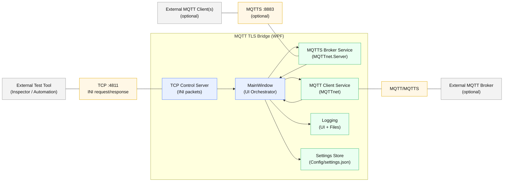

---

### Control Server Request-Response Sequence

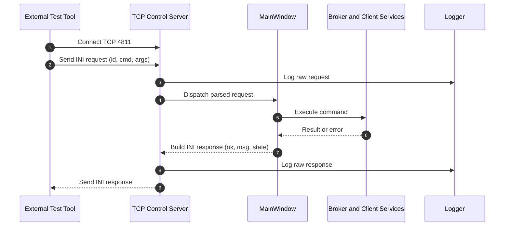

---

### Client Connection Status Diagram

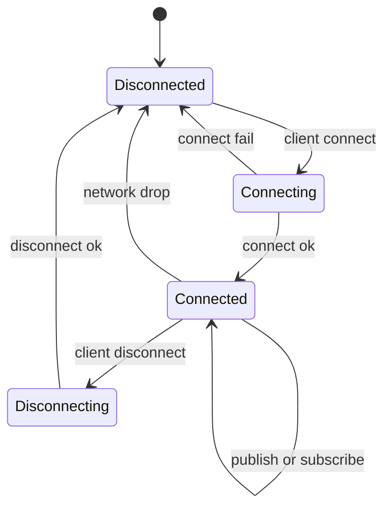

---

### TLS Certificate Verification Mode Determination Flow

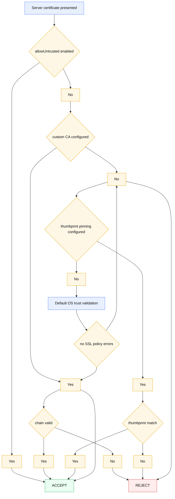

---

### Test Flow

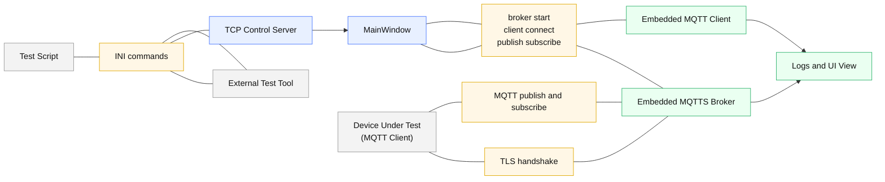

---

### Broker Lifecycle diagram

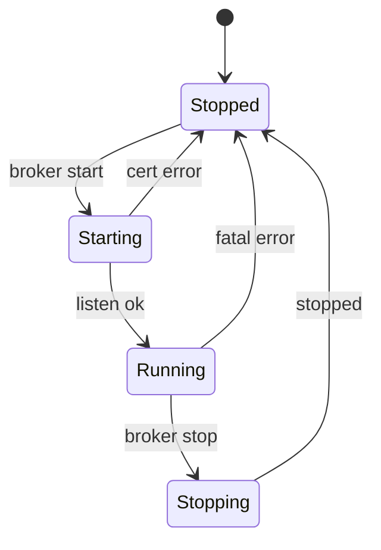

The embedded broker has an explicit lifecycle.
All transitions are logged and reflected in the UI state.

---

### Client Lifecycle + Retry Perspective Diagram

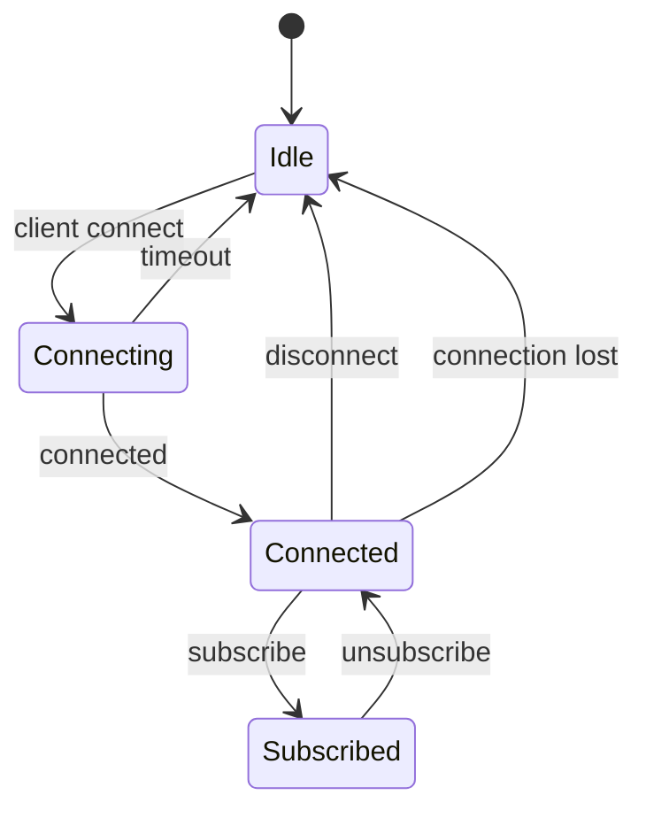

---

### INI Command Processing Pipeline

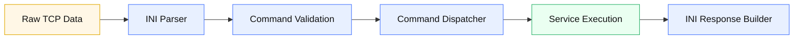

---

### Error Handling & Logging Flow

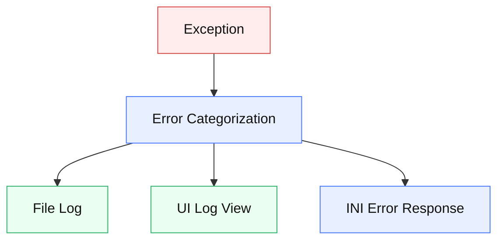

All errors are centrally categorized and reported consistently
to logs, UI, and control responses.

---

### Topic Flow

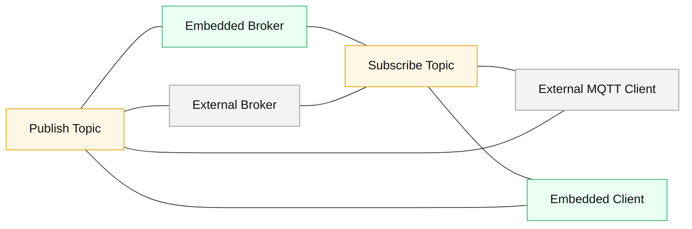

---

### Configuration loading flow

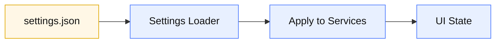

---

### Typical Automated Test Scenario

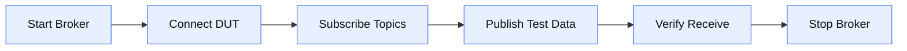

---

## Troubleshooting

This section lists common failure scenarios and suggested resolutions.

### Broker fails to start

Possible causes:

  - Broker port already in use

  - Invalid or missing PFX certificate

  - Incorrect PFX password

  - TLS protocol mismatch

Recommended actions:

  - Verify the port is not used by another process

  - Validate the PFX file using system tools

  - Confirm TLS version compatibility

---

### Client connection fails

Possible causes:

  - TLS version mismatch (1.2 vs 1.3)

  - Certificate validation mode mismatch

  - Incorrect host or port

  - Connection timeout

Recommended actions:

  - Temporarily enable allowUntrusted=1 to isolate trust issues

  - Verify timeoutMs value

  - Check broker logs for handshake errors

---

### TLS handshake errors

Possible causes:

  - Unsupported TLS protocol

  - Invalid certificate chain

  - Incorrect custom CA configuration

  - Thumbprint mismatch

Notes:

  - Certificate thumbprints are normalized before comparison

  - Whitespace and case differences are ignored

---

### Control server does not respond

Possible causes:

  - Missing blank line at end of packet

  - Incorrect text encoding (must be UTF-8)

  - Firewall blocking the control port

  - Remote connections disabled in settings

---

### Security Notes

The control server is intended for local automation by default.

  - Binding to loopback interface is recommended

  - Enabling remote access requires explicit firewall configuration

  - Raw control packets (RX/TX) are logged to disk

  - Logs may contain sensitive information

  - Disabling “Save passwords” prevents credential persistence

---

### Design Principles

The following principles guide the overall design of the application.

  - The UI acts as an orchestration layer, not a protocol endpoint

  - All automation is performed through the TCP control server

  - Broker and client can operate independently or simultaneously

  - Error handling and logging are centralized

  - State transitions are explicitly tracked and logged

---

### Intended Use Cases

  - MQTT/TLS interoperability testing

  - TLS 1.2 and TLS 1.3 negotiation validation

  - Certificate trust and pinning verification

  - Automated regression testing of MQTT-enabled devices

  - Controlled fault injection and protocol inspection

---

## Download

Prebuilt binaries are available on the GitHub Releases page.

- Windows (net10.0-windows)
- No installer required

See: **Releases → v0.1.0**
